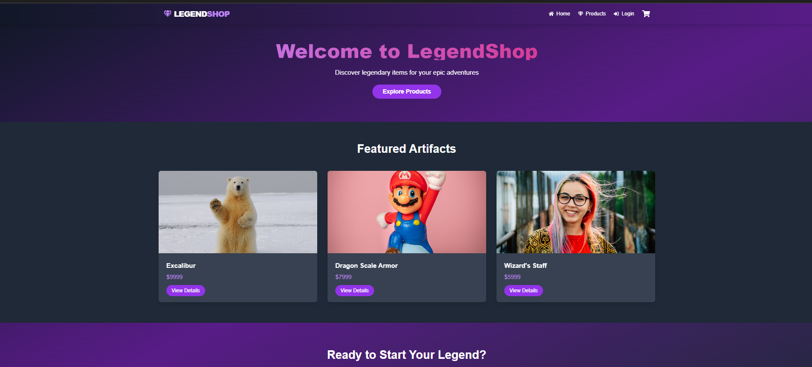

# 🏰 LegendShop: Epic E-commerce for Legendary Items



Welcome to LegendShop, where myths become reality and legends are for sale! 🐉⚔️🛡️

## ✨ Features

- 🎨 Stunning, responsive UI with smooth animations
- 🛒 Dynamic shopping cart with real-time updates
- 🔍 Detailed product pages with interactive elements
- 📱 Mobile-friendly design with an epic hamburger menu
- 🌈 Gradient backgrounds that bring your adventure to life
- 🔮 404 page with magical animations

## 🚀 Tech Stack

- **Next.js** - React framework for server-side rendering and routing
- **React** - UI component library
- **Framer Motion** - For those buttery-smooth animations
- **Tailwind CSS** - Utility-first CSS framework for rapid UI development
- **React Icons** - Because every hero needs an icon

## 🛠️ Installation

1. Clone the repository of legends:
   ```
   git clone https://github.com/your-username/legendshop.git
   ```

2. Navigate to the project directory:
   ```
   cd legendshop
   ```

3. Install the magical dependencies:
   ```
   npm install
   ```

4. Start the development server:
   ```
   npm run dev
   ```

5. Open [http://localhost:3000](http://localhost:3000) with your browser to see the result.

## 🧙‍♂️ Usage

- Browse our legendary items on the home page
- Click on a product to view its epic details
- Add items to your cart and watch the cart icon update in real-time
- Navigate to the cart page to review your legendary haul
- Proceed to checkout (coming soon in the next update!)

## 📸 Screenshots


## 🎨 Color Palette

| Color          | Hex Code |
|----------------|----------|
| Primary        | #9333EA  |
| Secondary      | #4B5563  |
| Accent         | #F472B6  |
| Background     | #111827  |

## 🤝 Contributing

Contributions, issues, and feature requests are welcome! Feel free to check [issues page](https://github.com/your-username/legendshop/issues).

## 📜 License

This project is [MIT](https://choosealicense.com/licenses/mit/) licensed.

## 🙌 Acknowledgements

- [Next.js Documentation](https://nextjs.org/docs)
- [Tailwind CSS](https://tailwindcss.com/)
- [Framer Motion](https://www.framer.com/motion/)
- [React Icons](https://react-icons.github.io/react-icons/)

---

Made with ❤️ and a sprinkle of magic dust by misikirayu
